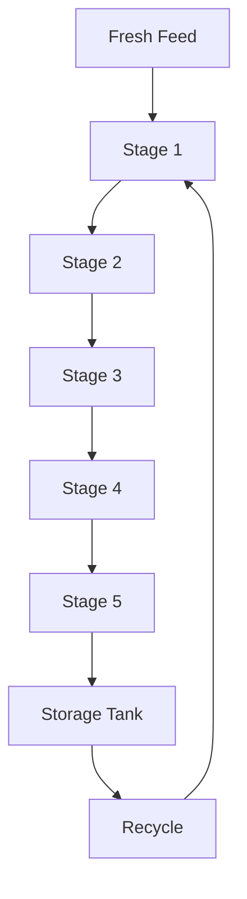

# Microalgae-Bioreactor

A computational model of a multi-stage microalgae photobioreactor coupling droplet hydrodynamics, light transport, photosynthetic dynamics and biomass growth.

The model investigates how hydrodynamic and optical conditions influence light availability and microalgae growth throughout a five-stage reactor system. It combines a mechanistic description of droplet behaviour with Mie scattering, a two-flux radiative transfer model and nonlinear ordinary differential equations describing photosystem and biomass dynamics.

# Model Architecture

## State Variables

Each illuminated stage tracks seven state variables:

| Variable | Description |
|---|---|
| `X` | Live biomass concentration |
| `Xd` | Non-active / dead biomass concentration |
| `A` | Active PSII fraction |
| `B` | Occupied PSII fraction |
| `C` | Damaged PSII fraction |
| `alpha` | NPQ / photoacclimation state |
| `Ig` | Acclimation irradiance |

The storage tank additionally tracks biomass and the PSII states under dark conditions.
# Numerical Solution

The coupled nonlinear ODE system is constructed using the MAGNUS modelling environment, with symbolic model variables defined through pymc and integration performed using cronos.ODESLV.

The solver uses configurable parameters including relative tolerance, absolute tolerance, maximum and minimum integration step sizes, maximum number of integration steps and dense linear solver. 

The current simulation evaluates the reactor over a long-term time horizon of up to 365 days.
