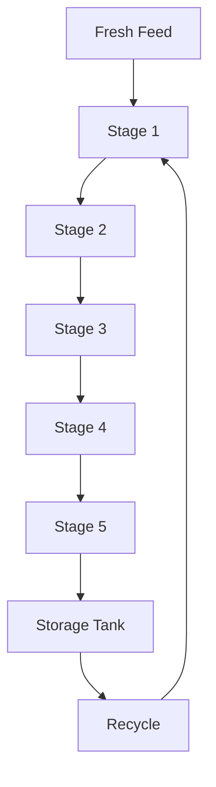

# Microalgae-Bioreactor

A computational model of a multi-stage spray-based microalgae photobioreactor coupling droplet hydrodynamics, light transport, photosynthetic dynamics and biomass growth.

The model investigates how hydrodynamic and optical conditions influence light availability and microalgae growth throughout a five-stage reactor system. It combines a mechanistic description of droplet behaviour with Mie scattering, a two-flux radiative transfer model and nonlinear ordinary differential equations describing photosystem and biomass dynamics. Analysis of dilution rate and model resolution identified operating conditions that produced a 3.8-fold increase in predicted biomass concentration.

# Model Architecture

## State Variables

Each illuminated stage tracks seven state variables:

| Variable | Description |
|---|---|
| `X` | Live biomass concentration |
| `Xd` | Non-active / dead biomass concentration |
| `A` | Active PSII fraction |
| `B` | Occupied PSII fraction |
| `C` | Damaged PSII fraction |
| `alpha` | NPQ / photoacclimation state |
| `Ig` | Acclimation irradiance |

The storage tank additionally tracks biomass and the PSII states under dark conditions.
## Numerical Solution

The coupled nonlinear dynamic model is implemented using [MAGNUS](https://github.com/omega-icl/magnus), a mathematical modelling and analysis framework developed by the OMEGA Research Group at Imperial College London.

Model states and parameters are constructed through the Python interface, with numerical integration performed using the CRONOS ODE solver. The resulting system couples spray hydrodynamics, optical transport, photosystem dynamics and biomass growth across the multi-stage reactor.

Solver settings including relative and absolute tolerances, integration step sizes and maximum iteration limits can be configured for long-term reactor simulations.

## Tools & Dependencies

- **Python** – model implementation and analysis
- **NumPy** – numerical calculations
- **Matplotlib** – data visualisation
- **[MAGNUS](https://github.com/omega-icl/magnus)** – mathematical model construction and analysis
- **CRONOS** – numerical integration of the dynamic system

> **Note:** MAGNUS is an external dependency and must be installed separately. See the [MAGNUS repository](https://github.com/omega-icl/magnus) for installation instructions.
